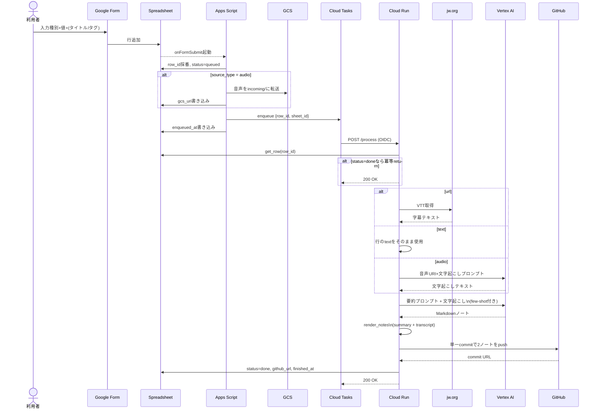
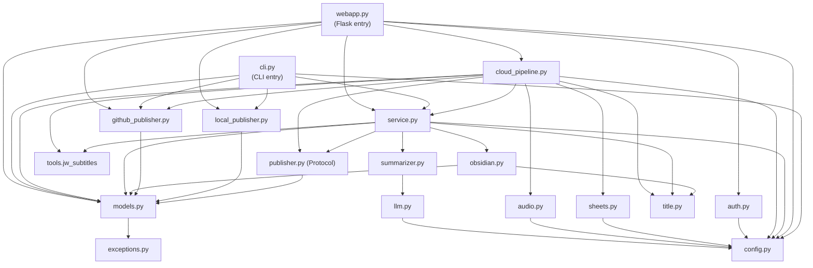

# アーキテクチャ図: jw-summarize-cloud

`docs/design/cloud-pipeline.md` の設計判断を、図と依存関係でひと目で追えるようにまとめたもの。
コードを読まずに「どのスクリプトが何をして、何に依存しているか」「クラウド上で何がどう繋がっているか」を把握するための索引。

---

## 1. クラウド全体アーキテクチャ

Google Form 経由で投入された 1 行が、Cloud Tasks 経由で Cloud Run に届き、Vertex AI で要約され、GitHub に commit されるまでの全体像。

```mermaid
flowchart LR
    subgraph User["利用者"]
        Human["人間（ブラウザ）"]
    end

    subgraph Workspace["Google Workspace"]
        Form["Google Form\n（受付UI）"]
        Sheet["Spreadsheet\n（管理台帳）"]
        Drive["Drive\n（Form添付の一時保管）"]
        AppsScript["Apps Script\nonFormSubmit / monitorQueuedRows"]
    end

    subgraph GCP["GCP（asia-northeast1）"]
        Tasks["Cloud Tasks\nQueue: jw-summarize-process"]
        Run["Cloud Run\njw-summarize-web (Flask + gunicorn)"]
        GCS["GCS\nincoming/&lt;row_id&gt;.&lt;ext&gt;\n7日Lifecycle"]
        Vertex["Vertex AI\nGemini 2.5 Pro / Flash"]
        Secret["Secret Manager\nGITHUB_TOKEN ほか"]
    end

    subgraph External["外部"]
        JWorg["jw.org\n（字幕VTT）"]
        GitHub["GitHub\nObsidian Vault リポジトリ"]
    end

    Human -->|入力| Form
    Form -->|行追加| Sheet
    Sheet -->|onFormSubmit| AppsScript
    AppsScript -->|audioのみコピー| Drive
    AppsScript -->|audioをコピー| GCS
    AppsScript -->|enqueue\n{row_id, sheet_id}| Tasks
    Tasks -->|POST /process\nOIDC| Run
    Run -->|read row| Sheet
    Run -->|VTT取得 (urlのみ)| JWorg
    Run -->|音声URI渡し\n(audioのみ)| GCS
    Run -->|文字起こし/要約| Vertex
    Run -->|fetch secrets| Secret
    Run -->|commit| GitHub
    Run -->|update status=done| Sheet
    AppsScript -.->|15分毎\nfailed判定| Sheet
```

ポイント:

- **書き込みは Cloud Run と Apps Script の二系統だけ**。Cloud Run は成功時のみ Sheet を更新する。失敗確定は Apps Script の監視トリガーが担当する。
- **音声ファイル本体は Cloud Run に DL しない**。GCS URI を Vertex AI に直接渡す。
- **シークレットはコードに置かない**。Cloud Run 実行 SA が Secret Manager から取得する。

---

## 2. リクエスト処理シーケンス

入力種別ごとに分岐する正常系。`row_id` は Cloud Tasks リトライ時の冪等キー。



失敗系は `cloud-pipeline.md` §3.2 を参照。Cloud Tasks の最大 3 試行を超えた行は、Apps Script の `monitorQueuedRows` が 120 分後に `failed` に確定する。

---

## 3. スクリプト構成: 各ファイルの役割

### 3.1 Python パッケージ `tools/jw_summarize/`

Cloud Run の Flask アプリ本体。`webapp.py` がエントリポイント、以下が層別に並ぶ。

| ファイル | 役割 | 主な依存（同パッケージ） | 主な外部依存 |
|---|---|---|---|
| `webapp.py` | Flask アプリ。`/healthz` と `/process` を提供。`/process` ペイロードを見て **Cloud 経路** と **直接呼び出し経路** を振り分ける | `auth`, `cloud_pipeline`, `config`, `exceptions`, `github_publisher`, `local_publisher`, `models`, `service` | `flask`, `python-dotenv` |
| `cloud_pipeline.py` | Cloud Tasks からの `{row_id, sheet_id}` を受け、Sheet 行 → `ProcessingRequest` 化 → 要約実行 → Sheet 更新まで担当 | `audio`, `config`, `exceptions`, `github_publisher`, `models`, `publisher`, `sheets`, `service`, `title` | `requests`, `tools.jw_subtitles` |
| `service.py` | 入力種別に応じて transcript を解決し、`SummarizationService` で要約 → ノート生成 → publish を直列実行 | `config`, `exceptions`, `models`, `obsidian`, `publisher`, `summarizer`, `title` | `tools.jw_subtitles` |
| `summarizer.py` | LLM プロンプト（system + few-shot + human）を構築し Vertex/OpenAI を呼ぶ。Markdown 要約本体を返す | `config`, `exceptions`, `llm` | `langchain-core` |
| `llm.py` | provider/profile から `ChatVertexAI` または `ChatOpenAI` インスタンスを生成 | `config`, `exceptions` | `langchain-google-vertexai`, `langchain-openai`, `google-cloud-aiplatform` |
| `audio.py` | GCS URI を Vertex AI Gemini に渡して日本語文字起こしを生成 | `config`, `exceptions` | `google-cloud-aiplatform` (`vertexai.generative_models`) |
| `sheets.py` | Spreadsheet 管理台帳の読み込みと成功時更新 (`status=done`) を担当 | `config`, `exceptions` | `google-api-python-client` |
| `auth.py` | `/process` の認可。`WEBHOOK_SHARED_SECRET` か Cloud Tasks の OIDC ID トークンを検証 | `config`, `exceptions` | `flask`, `google-auth` |
| `models.py` | `ProcessingRequest` / `ProcessingResult` / `RenderedNote` / `PublishResult` などの dataclass | `exceptions` | （標準ライブラリのみ） |
| `obsidian.py` | summary note と transcript note を Markdown としてレンダリング。frontmatter / リンクを構築 | `config`, `models`, `title` | - |
| `title.py` | タイトル抽出・ファイル名サニタイズ。LLM 不使用の決定論ロジック | - | - |
| `publisher.py` | `Publisher` Protocol 定義（`publish` メソッドを持つ） | `models` | - |
| `github_publisher.py` | GitHub REST API で commit を作り、summary + transcript を 1 コミットで push | `config`, `exceptions`, `models` | `requests` |
| `local_publisher.py` | ローカルディレクトリへの書き出し（開発・テスト用） | `models` | - |
| `config.py` | 環境変数を `Settings` dataclass に集約。各モジュールはここからしか env を読まない | - | （標準ライブラリのみ） |
| `exceptions.py` | アプリ層の例外階層（`AuthError` / `ValidationError` / `ProcessingError` / `PublishError`） | - | - |
| `cli.py` | ローカル CLI（`python -m tools.jw_summarize`）。Cloud Run を介さず手元で実行するため | `config`, `github_publisher`, `local_publisher`, `models`, `service` | `python-dotenv` |

### 3.2 Python パッケージ `tools/jw_subtitles/`

jw.org の動画ページ URL から字幕 VTT を取得し平文化する独立ツール。Cloud 経路と CLI 経路の両方から使う。

| ファイル | 役割 | 主な依存 |
|---|---|---|
| `jw_api.py` | jw.org の URL → pub-media API → VTT URL を解決 | `http`, `vtt` |
| `vtt.py` | WebVTT 文書 → 平文化する純関数 | - |
| `http.py` | 共通の HTTP GET ヘルパ | （標準ライブラリのみ） |
| `cli.py` / `__main__.py` | `python -m tools.jw_subtitles <url>` で字幕テキストを stdout か `--output` に出力 | `jw_api` |

### 3.3 Apps Script `scripts/cloud_pipeline/`

Spreadsheet に紐付ける GAS プロジェクト。Cloud Tasks への投入と監視を担う。

| ファイル | 役割 |
|---|---|
| `Code.gs` | `onFormSubmit`（受付時）と `monitorQueuedRows`（時間主導トリガー）。row_id 採番、audio の GCS 転送、Cloud Tasks への OIDC enqueue、120 分超過行の `failed` 確定 |
| `appsscript.json` | OAuth スコープ（cloud-platform / drive / external_request / script / spreadsheets.currentonly）とタイムゾーン |

---

## 4. Python モジュール依存グラフ

import 関係を上から下へ。`config` と `exceptions` は全層から参照される基盤層。



レイヤーの読み方:

1. **エントリ層**: `webapp.py`（HTTP）, `cli.py`（CLI）
2. **ユースケース層**: `cloud_pipeline.py`（Sheet 駆動）, `service.py`（直接実行）
3. **ドメイン層**: `summarizer`, `audio`, `obsidian`, `title`, `sheets`
4. **アダプタ層**: `llm`, `github_publisher`, `local_publisher`, `auth`, `tools.jw_subtitles`
5. **基盤層**: `config`（Settings）, `exceptions`, `models`, `publisher`(Protocol)

`cloud_pipeline.py` は `service.py` を **内部で組み立てて再利用** している（プロセス全体の制御役）。

---

## 5. データフロー: 1 件の処理が辿る型

Spreadsheet の 1 行が `commit_url` まで変換される過程の型遷移。

```
Spreadsheet row
  └─ ManagementRow (sheets.py)
       └─ CloudProcessRequest {row_id, sheet_id}     ← Cloud Tasks payload
            └─ ProcessingRequest                      ← cloud_pipeline._build_processing_request
                 │   source_type: "url"|"text"|"audio"
                 │   raw_text: transcript            ← jw_subtitles or audio.transcribe_gcs_audio
                 │   title_override
                 │   metadata: {tags, gcs_uri?}
                 ↓
            summary_markdown (str)                   ← summarizer.summarize_text
                 ↓
            (RenderedNote summary, RenderedNote transcript)  ← obsidian.render_notes
                 ↓
            PublishResult {commit_sha, commit_url}   ← github_publisher.publish
                 ↓
            ProcessingResult                          ← Spreadsheet に status=done で書き戻し
```

---

## 6. 環境変数と読み手モジュール

`Settings.from_env()` が一括ロードする。各モジュールは `Settings` を受け取り、自分で `os.getenv` しない。

| 環境変数 | 用途 | 読む側（実体） |
|---|---|---|
| `LLM_PROVIDER`, `LLM_PROFILE` | LLM 切替（`vertexai`/`openai`、`heavy`/`light`） | `llm.py` |
| `VERTEX_PROJECT_ID` / `GOOGLE_CLOUD_PROJECT` / `PROJECT_ID` | Vertex AI 初期化 | `llm.py`, `audio.py` |
| `VERTEX_LOCATION`, `VERTEX_HEAVY_MODEL`, `VERTEX_LIGHT_MODEL` | Vertex AI モデル指定 | `llm.py`, `audio.py` |
| `OPENAI_API_KEY`, `OPENAI_HEAVY_MODEL`, `OPENAI_LIGHT_MODEL` | OpenAI バックエンド（任意） | `llm.py` |
| `GITHUB_TOKEN`, `GITHUB_REPOSITORY`, `GITHUB_BRANCH`, `GITHUB_API_BASE` | Obsidian Vault への commit | `github_publisher.py` |
| `OBSIDIAN_SUMMARY_DIR`, `OBSIDIAN_TRANSCRIPT_DIR` | ノート保存先パス | `obsidian.py` |
| `LOCAL_OUTPUT_DIR` | ローカル開発時の出力先 | `local_publisher.py`, `cli.py` |
| `WEBHOOK_SHARED_SECRET` | `/process` の共有シークレット認証 | `auth.py` |
| `GOOGLE_OIDC_AUDIENCE` / `CLOUD_RUN_AUDIENCE` | Cloud Tasks → Cloud Run の OIDC 検証 | `auth.py` |
| `GCP_PROJECT_ID`, `GCS_AUDIO_BUCKET` | 音声受け渡し用 GCS | `audio.py`（Apps Script からも） |
| `SHEETS_MANAGEMENT_ID`, `SHEETS_WORKSHEET_NAME` | 管理台帳の特定 | `sheets.py`, `cloud_pipeline.py` |
| `TASKS_QUEUE_NAME`, `TASKS_LOCATION` | Cloud Tasks Queue（参照のみ。enqueue は Apps Script 側） | （主に運用設定） |
| `FORM_*_COLUMN`, `SHEET_*_COLUMN` | Spreadsheet の列名カスタマイズ | `sheets.py`, `cloud_pipeline.py` |
| `HTTP_TIMEOUT_SECONDS` | 外部 HTTP（jw.org など）のタイムアウト | `cloud_pipeline.py` |

Apps Script 側は GAS の Script Properties（`CLOUD_RUN_PROCESS_URL` / `CLOUD_TASKS_SERVICE_ACCOUNT` / `FAILED_AFTER_MINUTES` ほか）を別ストアで持つ。詳細は `cloud-pipeline.md` §7.1。

---

## 7. デプロイ単位とランタイム特性

| 項目 | 値 | 由来 |
|---|---|---|
| Cloud Run image | Python 3.12 slim + `tools/jw_summarize/` + `tools/jw_subtitles/` | `pyproject.toml`, `Procfile` |
| エントリポイント | `gunicorn --bind :8080 --timeout 1800 tools.jw_summarize.webapp:app` | `Procfile`, `README.md` |
| CPU / Memory | `1 / 1Gi` | `cloud-pipeline.md` §4.5.1 |
| `--concurrency` | `1`（1 req = 1 ジョブ） | LLM 呼出が CPU/メモリ占有 |
| `--timeout` | `1800s`（= Cloud Tasks dispatchDeadline） | 30 分以内に収める前提 |
| `--max-instances` | `10`（= Cloud Tasks max concurrent dispatches） | 同時 10 並列まで |
| `--min-instances` | `0`（コールドスタート許容） | 無料枠運用 |
| Region | `asia-northeast1`（Run / Tasks / GCS / Vertex 統一） | D14 |

---

## 8. 関連ドキュメント

- 設計判断・スコープ・受け入れ基準: `docs/design/cloud-pipeline.md`
- GCP デプロイ手順（UI）: `docs/deploy/cloud-pipeline-gcp-ui.md`
- GCP デプロイ手順（CLI）: `docs/deploy/cloud-pipeline-gcp.md`
- リポジトリ概要: `README.md`
